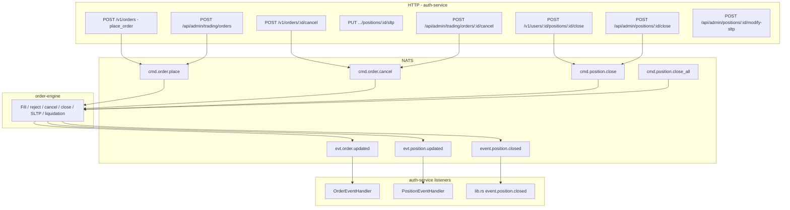

# User Events — Trading Extension Proposal

**Purpose:** Review where trading activity can be recorded in `user_events`, what already exists, and what to implement next.  
**Status:** Proposal only — no trading events are implemented yet.  
**Related:** [USER_EVENTS_HISTORY_PLAN.md](./USER_EVENTS_HISTORY_PLAN.md)

---

## 1. Executive summary

The **User events** admin page (`/admin/user-events`) is live with **auth**, **finance** (deposit approve/reject), and **admin** (impersonate) events. **Trading is not wired yet** — the plan listed it as Phase 2.

Trading in this platform is **async**: HTTP handlers usually publish NATS commands (`cmd.order.place`, `cmd.position.close`, …) and **order-engine** applies fills/closes. For audit history you should prefer:

| Approach | When to record | Pros | Cons |
|----------|----------------|------|------|
| **Outcome (recommended core)** | After order-engine confirms terminal state (`filled`, `cancelled`, `closed`, `liquidated`) | Accurate; one row per real market result | Slightly delayed; needs NATS handlers |
| **Intent (optional add-on)** | After HTTP accepts command (DB row + NATS publish) | Shows user/admin *attempt* even if engine rejects later | Higher volume; may not match final state |

**Recommendation:** Ship **outcome events first** (orders + position closed), then add **intent** events only if compliance needs “user clicked place order” before fill.

---

## 2. What exists today

### 2.1 Database & API

| Piece | Location | Notes |
|-------|----------|--------|
| Table | `user_events` | `infra/migrations/054_user_events.sql` |
| Write helper | `user_events_service::record_fail_open` | Fail-open; never blocks trading |
| Admin list API | `GET /api/admin/user-events` | Filters: user, category, event_type, dates, search |
| Permission | `user_events:view` | On Full Access profile |

### 2.2 Events currently recorded

| `event_type` | `category` | Where written | IP / UA |
|--------------|------------|---------------|---------|
| `auth.register` | `auth` | `AuthService::register` | Yes (register handler) |
| `auth.login` | `auth` | `AuthService::login` | Yes |
| `auth.logout` | `auth` | `AuthService::logout` | Yes |
| `auth.password_reset` | `auth` | `password_reset_confirm` in `routes/auth.rs` | Yes |
| `admin.impersonate` | `admin` | `AuthService::impersonate` | Yes (admin route) |
| `finance.deposit_approved` | `finance` | `approve_deposit` in `routes/deposits.rs` | Yes (admin IP) |
| `finance.deposit_rejected` | `finance` | `reject_deposit` in `routes/deposits.rs` | Yes (admin IP) |

**Not recorded today:** any `trading.*` events, profile edits, withdrawals, failed login, `auth.session_created`.

Legacy `audit_logs` still receives auth actions via `log_audit()`; trading has **no** audit_log instrumentation.

### 2.3 Frontend (admin User events page)

| File | Gap for trading |
|------|-----------------|
| `src/features/adminUserEvents/types.ts` | `EVENT_CATEGORIES` has auth/finance/admin — **no `trading`** |
| `UserEventsFiltersBar.tsx` | Event-type dropdown is **auth-only** |
| `EVENT_TYPE_LABELS` | No trading labels yet |
| Stats cards | Register / login / logout only — no trading breakdown |

API already supports `category=trading` and `event_type=trading.order_filled` (prefix match: `trading.order` matches `trading.order_filled`).

---

## 3. Trading flows in the codebase (where things happen)



### 3.1 User terminal (retail)

| Action | Route / handler | File | NATS / side effect |
|--------|-----------------|------|---------------------|
| Place order | `POST /v1/orders` | `routes/orders.rs` → `place_order` | Inserts `orders` row (`pending`); publishes `cmd.order.place` |
| Cancel order | `POST /v1/orders/:order_id/cancel` | `routes/orders.rs` → `cancel_order` | Updates DB to `cancelled`; publishes `cmd.order.cancel` |
| Close position | `POST /v1/users/:user_id/positions/:position_id/close` | `routes/deposits.rs` → `close_position` | Publishes `cmd.position.close` |
| Update SL/TP | `PUT .../positions/:position_id/sltp` | `routes/deposits.rs` → `update_position_sltp` | Updates Redis/DB path (see handler) |

### 3.2 Admin trading

| Action | Route / handler | File | NATS / side effect |
|--------|-----------------|------|---------------------|
| Create order for user | `POST /api/admin/trading/orders` | `routes/admin_trading.rs` → `create_admin_order` | `cmd.order.place` (idempotency `admin:{order_id}`) |
| Cancel order | `POST /api/admin/trading/orders/:id/cancel` | `cancel_admin_order` | Cancel flow |
| Force cancel | `POST /api/admin/trading/orders/:id/force` | `force_cancel_admin_order` | Force cancel |
| Close / partial close / liquidate | `POST /api/admin/positions/:id/close` (+ close-partial, liquidate) | `routes/admin_positions.rs` → `close_admin_position` | `cmd.position.close` + `admin.position.closed` |
| Modify SL/TP | `POST /api/admin/positions/:id/modify-sltp` | `modify_position_sltp` | `admin.position.sltp.modified` |
| Reopen position | `POST /api/admin/positions/:id/reopen` | `reopen_admin_position` | Reopen command to engine |
| Update position params | `POST /api/admin/positions/:id/update-params` | `update_admin_position_params` | Admin param change |

### 3.3 System-driven (no direct user click)

| Action | Trigger | File | NATS |
|--------|---------|------|------|
| Stop-out (close all) | Margin level &lt; group `stop_out_level` | `deposits.rs` → `try_publish_stop_out_close_all` | `cmd.position.close_all` |
| Liquidation (close all) | Margin level &lt; 0 | `deposits.rs` → `try_publish_liquidation_close_all` | `cmd.position.close_all` + `reason: liquidated` |
| SL / TP hit | order-engine | `event.position.closed` with `trigger_reason` SL / TP | Notifications in `create_sltp_notifications_and_push` |
| Order filled / rejected | order-engine | `evt.order.updated` → `OrderEventHandler` | DB sync on terminal status |

### 3.4 order-engine (out of scope for direct writes)

`apps/order-engine/` owns execution. **Do not** write to `user_events` from order-engine unless you add a shared crate and DB pool there. Prefer **auth-service NATS listeners** (already sync DB) as the single write path for outcomes.

---

## 4. Proposed trading event catalog

Naming convention: `trading.<entity>_<action>` with `category = trading`.

### 4.1 Tier A — Recommended first (outcomes + high-value admin)

Record **after success** in NATS handlers or when DB reflects terminal state.

| `event_type` | When | `subject_user_id` | `actor_user_id` | Suggested `meta` |
|--------------|------|-------------------|-----------------|------------------|
| `trading.order_filled` | `OrderEventHandler` sees `OrderStatus::Filled` | Order owner | `null` (system) or admin if `idempotency_key` starts with `admin:` | `order_id`, `symbol`, `side`, `size`, `avg_fill_price`, `filled_size` |
| `trading.order_cancelled` | Order cancelled (user, admin, or engine) | Order owner | User/admin if known from cancel path | `order_id`, `symbol`, `cancelled_by` (`user` \| `admin` \| `system`) |
| `trading.order_rejected` | `OrderStatus::Rejected` | Order owner | `null` | `order_id`, `symbol`, `reason` (if available) |
| `trading.position_closed` | `event.position.closed` (all non-liquidation closes) | Position owner | User/admin if close was manual | `position_id`, `symbol`, `trigger_reason`, `realized_pnl`, `close_size` |
| `trading.position_liquidated` | `trigger_reason = liquidated` | Position owner | `null` (system) | `position_id`, `symbol`, `margin_level` |
| `trading.stop_out_triggered` | `try_publish_stop_out_close_all` fires | User | `null` | `margin_level`, `threshold`, `correlation_id` |
| `trading.admin_order_placed` | Admin `create_admin_order` succeeds | Target user | Admin | `order_id`, `symbol`, `side`, `size`, `order_type` |
| `trading.admin_position_closed` | Admin `close_admin_position` succeeds | Position owner | Admin | `position_id`, `symbol`, `closed_size` |

### 4.2 Tier B — Intent / request (optional, higher volume)

Record at HTTP layer **after** DB/NATS accept (same pattern as auth — fail-open).

| `event_type` | When | Notes |
|--------------|------|--------|
| `trading.order_placed` | `place_order` after insert + NATS publish | **High volume** on active platforms; consider admin-only or sampling |
| `trading.order_cancel_requested` | `cancel_order` after DB update | Pairs with `order_cancelled` when engine confirms |
| `trading.position_close_requested` | `close_position` after NATS publish | Command may still fail in engine |
| `trading.position_sltp_updated` | User `update_position_sltp` | `stop_loss`, `take_profit` in meta |
| `trading.admin_order_cancelled` | Admin cancel routes | Include `admin_id` as actor |
| `trading.admin_sltp_modified` | `modify_position_sltp` | Admin actor |

### 4.3 Tier C — Later / lower priority

| `event_type` | When |
|--------------|------|
| `trading.position_reopened` | Admin `reopen_admin_position` |
| `trading.position_params_updated` | Admin `update_admin_position_params` |
| `trading.bulk_order_placed` | Bulk order endpoints in `orders.rs` (if used) |
| `trading.sync_pending` | `sync_pending_orders` maintenance |

---

## 5. Instrumentation map (exact hook points)

Use `record_user_event_fail_open` or `UserEventsService::record_fail_open`. Pass IP/UA only on HTTP handlers (`extract_client_meta` + `ConnectInfo`).

### 5.1 Outcome hooks (Tier A)

| # | File | Function / location | Event | Notes |
|---|------|---------------------|-------|--------|
| 1 | `services/order_event_handler.rs` | After `update_order_in_database` succeeds for `Filled` | `trading.order_filled` | Has `OrderUpdatedEvent` payload |
| 2 | `services/order_event_handler.rs` | After cancel update succeeds | `trading.order_cancelled` | Distinguish source if payload includes it |
| 3 | `services/order_event_handler.rs` | After reject update succeeds | `trading.order_rejected` | |
| 4 | `lib.rs` | Inside `event.position.closed` subscriber loop (after parse `inner`) | `trading.position_closed` or `trading.position_liquidated` | Branch on `trigger_reason` |
| 5 | `routes/deposits.rs` | End of `try_publish_stop_out_close_all` after NATS publish OK | `trading.stop_out_triggered` | System actor |
| 6 | `routes/deposits.rs` | End of `try_publish_liquidation_close_all` after NATS publish OK | Could use `trading.stop_out_triggered` meta or separate `liquidation_triggered` before close-all completes | |
| 7 | `routes/admin_trading.rs` | End of `create_admin_order` success | `trading.admin_order_placed` | `actor = claims.sub` |
| 8 | `routes/admin_positions.rs` | End of `close_admin_position` after NATS OK | `trading.admin_position_closed` | `actor = claims.sub` |

**Avoid duplicate rows:** Do not also record in `position_event_handler` on every `evt.position.updated` — that fires on ticks/mark updates. Use **`event.position.closed`** for closes only.

### 5.2 Intent hooks (Tier B)

| # | File | Function | Event |
|---|------|----------|-------|
| 9 | `routes/orders.rs` | `place_order` — before return `Ok(Json(PlaceOrderResponse))` | `trading.order_placed` |
| 10 | `routes/orders.rs` | `cancel_order` — after `rows_affected > 0` | `trading.order_cancel_requested` |
| 11 | `routes/deposits.rs` | `close_position` — after NATS publish OK | `trading.position_close_requested` |
| 12 | `routes/deposits.rs` | `update_position_sltp` — on success | `trading.position_sltp_updated` |
| 13 | `routes/admin_trading.rs` | `cancel_admin_order` / `force_cancel_admin_order` | `trading.admin_order_cancelled` |
| 14 | `routes/admin_positions.rs` | `modify_position_sltp` | `trading.admin_sltp_modified` |

### 5.3 Shared helper (suggested small refactor)

Add in `user_events_service.rs` or `utils/trading_events.rs`:

```rust
pub async fn record_trading_event(
    pool: &PgPool,
    subject_user_id: Uuid,
    actor_user_id: Option<Uuid>,
    event_type: &'static str,
    meta: serde_json::Value,
) { ... }
```

Category is always `"trading"`. Keeps call sites one line.

---

## 6. Volume, retention, and performance

| Concern | Guidance |
|---------|----------|
| **Order placed (intent)** | Can be 10–100× login rate on active symbols. Default: **omit** or record only `trading.order_filled`. |
| **Position ticks** | Never record `evt.position.updated` — too noisy. |
| **Fail-open** | Required for all trading hooks (same as auth). |
| **Indexes** | Existing `(event_type, created_at)` and `(subject_user_id, created_at)` are enough for admin UI. |
| **Retention** | Plan doc §10 — archival after 12–24 months; trading rows dominate growth. |

Rough local DB today: ~610 `user_events` (mostly backfilled auth). One active trader could add thousands of rows/month if every `order_placed` is logged.

---

## 7. Frontend changes (when you approve implementation)

| Change | File |
|--------|------|
| Add `{ value: 'trading', label: 'Trading' }` to `EVENT_CATEGORIES` | `types.ts` |
| Trading event type filter (filled, cancelled, position closed, …) | `UserEventsFiltersBar.tsx` |
| Labels in `EVENT_TYPE_LABELS` | `types.ts` |
| Optional stats: “Orders filled”, “Positions closed” | `UserEventsStatsCards.tsx` + `AdminUserEventsPage.tsx` |
| Badge color for `category === 'trading'` | `UserEventsTable.tsx` |

No API contract change required if event names match above.

---

## 8. Backfill (historical trading)

| Source | Feasibility |
|--------|-------------|
| `orders` table | Backfill `trading.order_filled` / `cancelled` / `rejected` from `status`, `filled_at`, `cancelled_at` |
| `positions` table | Backfill `trading.position_closed` / `liquidated` from `status`, `closed_at` |
| Redis / NATS | Not durable — do not use for backfill |

Script pattern: extend `backfill_user_events.rs` or new `backfill_trading_user_events.rs` with `INSERT … SELECT` and `NOT EXISTS` dedupe (same as audit backfill).

---

## 9. Decisions needed from you

Please comment on this file (or reply in chat) with your choices:

1. **Tier A only, or A + B?** (outcomes only vs. also intent events like `order_placed`)
2. **Include system events?** (`stop_out_triggered`, `liquidation` / close-all)
3. **Admin events naming:** separate `trading.admin_*` types vs. same types with `actor_user_id` set?
4. **Volume cap:** OK to skip `trading.order_placed` for retail and only log fills?
5. **Backfill:** Import last N days from `orders` / `positions` tables?

---

## 10. Suggested implementation order

1. `trading.order_filled`, `trading.order_cancelled`, `trading.order_rejected` — `order_event_handler.rs`
2. `trading.position_closed`, `trading.position_liquidated` — `lib.rs` `event.position.closed`
3. Admin: `trading.admin_order_placed`, `trading.admin_position_closed`
4. System: `trading.stop_out_triggered` (+ liquidation trigger if desired)
5. Frontend filters + labels
6. Optional Tier B intent events
7. Optional SQL backfill

---

## 11. References

| Resource | Path |
|----------|------|
| Original plan (Phase 2 trading rows) | `docs/USER_EVENTS_HISTORY_PLAN.md` §3.4 |
| Event service | `backend/auth-service/src/services/user_events_service.rs` |
| Admin API | `backend/auth-service/src/routes/admin_user_events.rs` |
| Order outcomes | `backend/auth-service/src/services/order_event_handler.rs` |
| Position closed | `backend/auth-service/src/lib.rs` (`event.position.closed`) |
| User place/cancel | `backend/auth-service/src/routes/orders.rs` |
| User close / SLTP | `backend/auth-service/src/routes/deposits.rs` |
| Admin orders | `backend/auth-service/src/routes/admin_trading.rs` |
| Admin positions | `backend/auth-service/src/routes/admin_positions.rs` |
